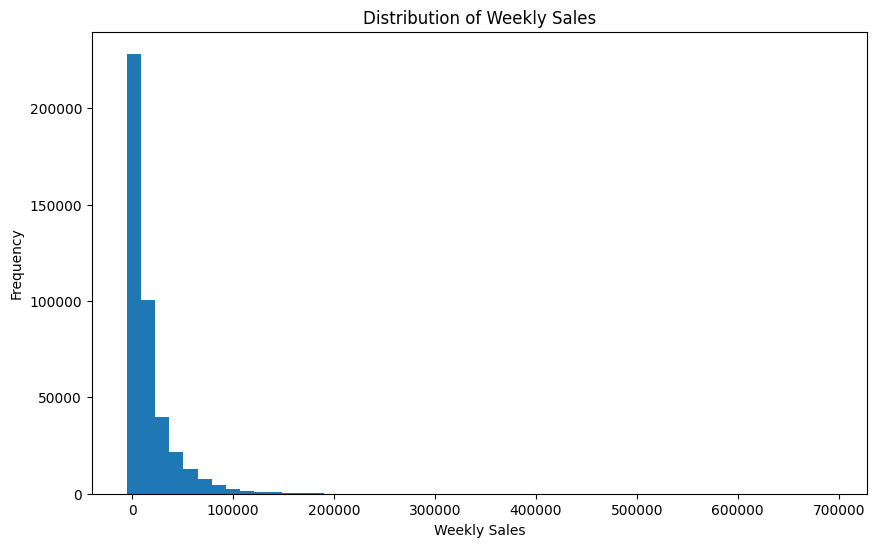
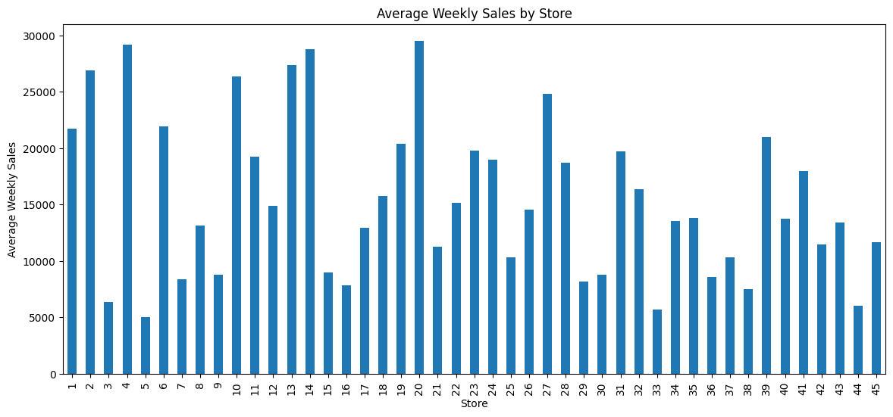
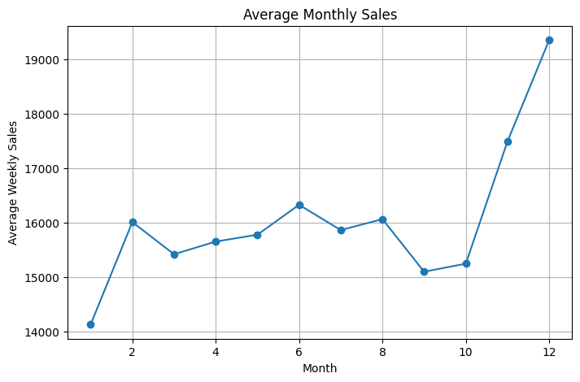
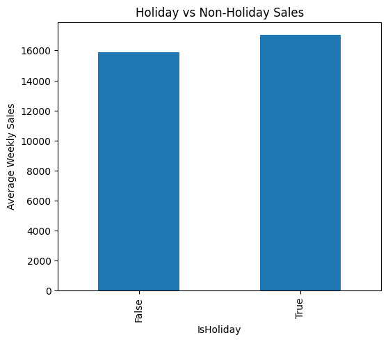
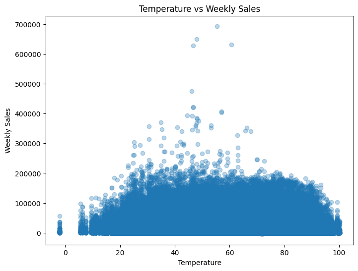
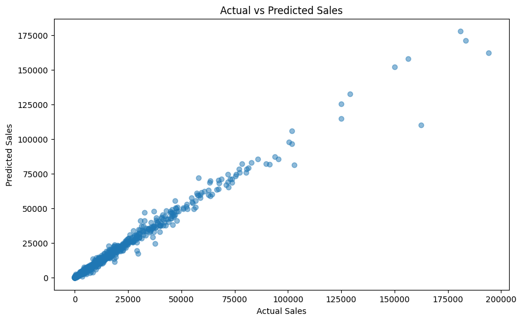

# 📈 Sales Demand Forecasting

## Future Interns Machine Learning Task 1

### Project Overview

This project predicts Walmart weekly sales using Machine Learning.

The objective is to help businesses forecast demand accurately for better inventory management and business planning.

---

## Dataset

Walmart Sales Forecast Dataset

Files Used:
- train.csv
- test.csv
- stores.csv
- features.csv

---

## Technologies Used

- Python
- Google Colab
- Pandas
- NumPy
- Matplotlib
- Scikit-learn

---

## Machine Learning Model

Random Forest Regressor

---

## Exploratory Data Analysis

The project includes:

- Sales Distribution
- Store-wise Sales
- Department-wise Sales
- Monthly Sales Trend
- Holiday vs Non-Holiday Sales
- Temperature vs Sales
- Fuel Price vs Sales
- Feature Importance

---

## Model Performance

- Mean Absolute Error (MAE)
- Mean Squared Error (MSE)
- Root Mean Squared Error (RMSE)
- R² Score ≈ 0.978

---

## Business Insights

- Holiday weeks generate higher sales.
- Sales increase during year-end months.
- Large stores contribute more revenue.
- Temperature has little impact on sales.
- Random Forest provides highly accurate predictions.

---

## Author

Pallavi B

Future Interns ML Internship

## Project Visualizations

### Sales Distribution

### Store-wise Sales

### Monthly Sales Trend

### Holiday vs Non-Holiday Sales

### Feature Importance

### Actual vs Predicted Sales

